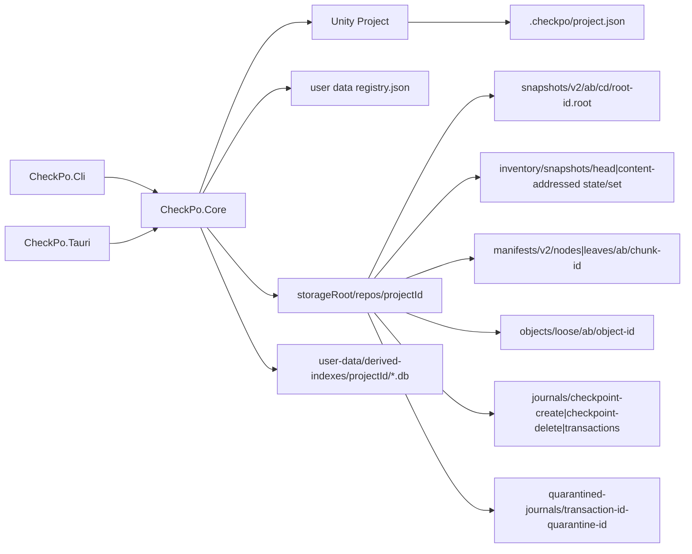

# アーキテクチャ

この文書は CheckPo Local の現在の実装を説明します。

## 全体像

CheckPo Local は、Unity プロジェクトの `Assets/**`、`Packages/**`、`ProjectSettings/**` に含まれるファイルだけを checkpoint / diff / restore / discard の対象にします。Git の branch / merge / conflict などの概念はユーザーに見せません。

プロジェクト内には path-free marker だけを置き、checkpoint 内容の正本は外部 storage root の `snapshots/` と `objects/` に保存します。`repo.json` と `refs/` は形式、最新位置、変更後の表示名を保持する永続メタデータです。SQLite は再構築可能な index であり、正本ではありません。



## 安全境界

破壊的操作の安全境界は project root ではありません。対象にできるのは `TrackedUnityFilePath` として validation された file path だけです。

許可範囲:

```text
Assets/**
Packages/**
ProjectSettings/**
```

拒否するもの:

- `Assets`、`Packages`、`ProjectSettings` という root 自体
- `README.md`、`.git/config`、`Library/**`、`UserSettings/**`
- absolute path
- `..`、`.`、empty segment
- backslash、colon、Windows drive path
- Windows 予約名、末尾 dot/space の path segment

`TrackedUnityFilePath`、`SnapshotId`、`ObjectId` は deserialize 時にも validation を通します。snapshot v2 読み込み時は root/chunk のdomain-separated digest、binary envelope、schema、policy ID、canonical tree shape、portable key順序、summary、entry size、case/Unicode正規化後のpath衝突を検証します。壊れた root/chunk は restore / discard / diff / index / GC の通常操作へ渡しません。

## Core モジュール

| モジュール | 責務 |
| --- | --- |
| `path.rs` | `TrackedUnityFilePath`、`SnapshotId`、`ObjectId`、project/storage root 型、path validation。 |
| `project.rs` | project marker、storage registry、repo 初期化、project view 生成。 |
| `scanner.rs` | tracked roots のみを walk し、symlink を辿らず file entry を列挙。 |
| `storage.rs` | repo layout、repo config、atomic write、whole-file object store、snapshot store、repository lock。 |
| `checkpoint.rs` | checkpoint 作成、snapshot 保存、refs/latest 更新、best effort index 更新。 |
| `diff.rs` | snapshot と working tree の差分計算。 |
| `restore.rs` | working tree 全体を checkpoint へ戻す preview/apply 境界。 |
| `discard.rs` | 指定 tracked file path だけを checkpoint へ戻す preview/apply 境界。 |
| `transaction.rs` | restore/discard 共通の operation plan、journal、staging、backup move、mtime 復元、recovery、cleanup。 |
| `verify.rs` | repo / snapshot / object / refs/latest の quick/full verification。 |
| `db.rs` | SQLite index schema、snapshot/object index、index rebuild。 |
| `maintenance.rs` | storage summary、GC、project 内 CheckPo 一時ファイル cleanup。 |

## Project Marker と Registry

プロジェクト側:

```text
<Unity Project>/.checkpo/project.json
```

marker には次だけを保存します。

```json
{
  "schemaVersion": 1,
  "projectId": "uuid",
  "createdAtUtc": "2026-06-09T00:00:00.000000000Z"
}
```

storage root や project root の絶対パスは marker に入れません。storage root は user data dir 側の `registry.json` に project id ごとに保存します。

`projectId` は checkpoint lineage の ID であり、Unity project の物理 path ではありません。project root は移動・リネームされる前提で、registry の `lastProjectRootPath` は「最後に確認された場所」として扱います。

project を開いた時の location 判定:

1. 現在 path と registry の path が同じなら通常状態。
2. registry の path が存在しない、または存在しても同じ `projectId` の marker が無い場合は移動・リネーム扱い。registry を現在 path に更新できます。
3. registry の path に同じ `projectId` の marker が残っている場合はコピー疑い。Core は checkpoint 作成、削除、restore / discard apply、GC apply、index rebuild、storage root 変更などの変更操作を拒否します。

コピー疑いの場合、ユーザーは明示的に現在 path を同じ project として使うか、新しい `projectId` で別 project として開始します。履歴を複製して別 project にする機能は MVP 対象外です。

## Repository Layout

project storage root 側:

```text
<project-storage-root>/
  repos/<project-id>/
    repo.json
    refs/
      latest
      checkpoint_names.json
    snapshots/
      v2/
        ab/cd/<root-id>.root
    inventory/
      snapshots/
        head
        states/ab/<state-id>.state
        sets/
          roots/ab/<set-root-id>.root
          leaves/ab/<set-leaf-id>.leaf
    manifests/
      v2/
        nodes/ab/<node-id>
        leaves/ab/<leaf-id>
    objects/
      loose/ab/<object-id>
    indexes/                 # 予約済み。SQLite DBは置かない
    journals/
      checkpoint-create/<transaction-id>/journal.json
      checkpoint-create/.prepare-<transaction-id>/
      checkpoint-create/.cleanup-<transaction-id>-<nonce>/
      checkpoint-delete/<transaction-id>/
      checkpoint-delete/.prepare-<transaction-id>/
      checkpoint-delete/.cleanup-<transaction-id>-<nonce>/
      transactions/<transaction-id>/
        journal.json
        staged/
        backup/
    quarantined-journals/
      <transaction-id>-<quarantine-id>/
      <transaction-id>-<quarantine-id>.json
      <transaction-id>-<quarantine-id>.resolved
    recovery-rescues/
      <transaction-id>/objects/<object-id>
      <transaction-id>/records/<plan-id>.json
      <transaction-id>/active.json
    tmp/
    locks/
```

`repo.json` は schema version 2 / repository format 5 の完全一致を要求し、project id、hash algorithm、snapshot format、manifest chunk/storage format、object format、path key policyを固定します。format 5ではloose objectとmanifest chunkを先頭2桁の1段shardに保存し、snapshot inventoryを必須のportable dataとして保持し、canonical manifest leaf targetを32 KiBに固定します。未知・不足・旧versionは読み書き前に拒否し、migrationやfallbackは行いません。

保存領域は次の2群に分けます。

- 持ち運び可能な永続データ: `repo.json`、`refs/`、`inventory/`、`snapshots/`、`manifests/`、`objects/`。将来のバックアップ・クラウド転送対象です。
- 端末ローカル状態: user-dataの`registry.json`と`derived-indexes/<projectId>/`、repository内の`journals/`、`quarantined-journals/`、`recovery-rescues/`、`tmp/`、`locks/`。`derived-indexes/`は再構築でき、その他はその端末での進行中操作または復旧専用です。既定のproject storage rootはuser-dataと同じ場所ですが、カスタムstorage rootを設定してもregistryは移動しません。

`quarantined-journals/` はcheckpointの正本ではありません。ただし自動復旧できなかったtransactionの `journal`、`backup`、`staged` を保持する救済領域なので、ユーザーが状態を確認するまで削除しません。

`recovery-rescues/` もcheckpointの正本ではありません。復旧競合時に退避したobjectと解決planを保持し、外部exportまたは明示cleanupまで残します。quarantine時はこの領域もquarantineへ移動を試み、移動できなければ診断warningを残して元の場所に保持します。

### durability とpath安全境界

repositoryとUnity projectの変更処理は、検査済み絶対pathを後から開き直さず、root directory handleから各componentをno-followで辿ります。Unixは`openat`/`renameat`/`unlinkat`、Windowsはheld directory handleを`RootDirectory`にした`NtCreateFile`とhandle-based rename/deleteを使用し、開いたfile identityが変わっていないことを確認してから変更します。

file dataを同期した後、変更したparent directory handleを子から親の順に同期し、そのbarrierが成功してからjournalを次stateへ進めます。`refs/`、inventory、checkpoint/transaction journal、quarantine recordなどの可変metadataは、held parent内でtemporary作成、file fsync、relative rename、parent fsync、binding再検証まで完結させ、検査後に絶対pathを再解決しません。Windowsでは`FlushFileBuffers`がdirectory barrierを提供できないfilesystemなら成功扱いにせず操作を失敗させます。対象保証は、これらのflush要求を正しく実装するローカルfilesystem上のprocess crash/OS crash/電源断です。network filesystem、同期ソフトによるrepository直接変更、device firmwareがflush完了を偽る故障までは保証しません。Windows hard-power-offの実機反復試験は正式リリース判定で別途必須とします。

Unixでworking treeの既存fileをbackupする場合、検査済みpath名を後からrenameしません。held source fdからbackupをreflink clone（利用不可ならstream copy）し、hash、size、backup file fsync、readback、backup parent barrierを確認した後、元pathがハッシュ時と同じfile version / identityのままの場合だけ`unlinkat`します。backup側のdurable copyが先に成立するため、元fileの追加`fsync`は行いません。検査後に同一inodeへ書き込まれた場合も、別fileへ差し替えられた場合も処理を失敗させ、現在fileを残します。大量小fileは最大64fileのbackup/delete batchと最大32parent directoryのbarrierに分け、各batchでbackup成立後だけ元fileを外します。Windowsはheld file handleに対するrenameを使用します。

## Snapshot v2 と Object

snapshot root、manifest node、manifest leafは専用canonical binary codecを使用します。固定幅整数はbig-endian、文字列はUTF-8、unknown kind/version/flags、trailing bytes、上限超過を拒否します。IDは保存bytesだけでなく種類ごとのdomainも含めたBLAKE3です。

```text
RootId = BLAKE3("checkpo.snapshot-root.v2\0" || stored-root-bytes)
NodeId = BLAKE3("checkpo.manifest-node.v2\0" || stored-node-bytes)
LeafId = BLAKE3("checkpo.manifest-leaf.v2\0" || stored-leaf-bytes)
```

rootはproject、parent root、時刻、名称、tool version、manifest root参照、summaryだけを持ちます。manifestはportable path key範囲ごとのcompressed radix treeです。portable path keyはUnicode 16.0の `NFC -> locale非依存lowercase -> NFC` に固定し、依存crateのUnicode versionをcompile-time assertionで拘束します。leaf targetはcanonical encoded size 32 KiBで、node/leafの境界とprefixは一意に検証します。30,299 fileの実manifestで8/16/32/64 KiBを比較し、32 KiBは16 KiB比でchunk数を1,936から1,070へ44.7%削減しながら、0.1%変更時の新規chunk数も217から183へ削減したため採用しました。target変更はsnapshot IDを変えるためrepository format 5として固定し、format 4との互換/migrationは提供しません。

object id は file bytes の BLAKE3 です。MVP は whole-file CAS のみで、object path は `objects/loose/ab/<object-id>` です。

### 履歴規模

- path範囲ごとのcanonical chunkをcontent address化し、snapshot rootはchunk IDのMerkle treeだけを参照する。
- 同一chunkはcheckpoint間で共有し、公開後のroot/chunk/objectは不変とする。
- 公開snapshot集合は、snapshot idの先頭byteで256分割したcanonical set leaf、固定256 slotのset root、世代・親・操作IDを持つstateをcontent address化する。追加・削除は1 leafとset rootだけをpath-copyし、期待旧headとtransaction operation IDでexact replayを判定する。現在集合の参照は過去state chainを走査しない。
- manifest iterator/lookupはpath範囲単位で読み、index rebuildは共有chunk DAGを1回decodeしてcheckpoint/path multiplicityを伝播する。
- repositoryから読むmanifest raw chunk cacheはFIFOで4096件または64 MiBに制限し、検証済みsubtree cacheは100,000件または概算64 MiBに達したsnapshot境界で破棄する。単一snapshotの正しさ検証に必要なworking setはそのsnapshot内で保持するが、履歴数に比例する無制限cacheは保持しない。
- GC、verify、index rebuildはinventoryのcanonical集合と全物理rootが一致することを検証してから処理する。GCは全公開rootから到達chunk/objectをmarkし、破損・不正layout・symlink・expected size競合が1件でもあれば削除しない。
- GCと一時file cleanupはpreviewの全候補、project ID、inventory head、候補file identityを含むopaque plan IDを返す。applyはexclusive lock内で再解析し、plan IDが一致する場合だけ削除する。GUI表示が1000件で省略されても判定対象は全候補である。
- analyze/list/diff/restore preview/verifyはrepository shared lock、create/delete/restore apply/discard apply/index rebuild/GC applyはexclusive lockを取る。
- 「使用中の保存データ」は`roots + manifest chunks + loose objects`の実ファイルサイズであり、GC適用前の未到達データも削除されるまで含む。CLIは呼び出し時に同期集計し、GUIの通常更新はindex上のcheckpoint数・logical size・object数を先に表示した後、実ファイルサイズを1回だけbackground集計する。保存内容の変更後は再集計する。symlink/reparse pointがあれば実集計を失敗させる。

100、500、1000 checkpointの破壊可能な実volume回帰テストを持ちます。2026-07-14の最終実volume検証では30,298 tracked files（7.65 GB）×1000 checkpointを完走し、1000件目の増分作成1.493秒、checkpoint 2〜1000の中央値1.498秒 / p95 1.568秒、status 0.229秒、diff 0.691秒、index rebuild 3.942秒、full verify 25.994秒、欠損・不正・warning 0件でした。これは現在の検証点であり、異なるhardwareに同じ時間を保証する上限ではありません。100万fileの固定メモリ上限は保証せず、単一snapshotを使うdiff/restoreは現在も最終的にentry配列を構築します。

checkpoint 作成順:

1. repository lock を取得する。
2. pending transaction があれば拒否する。
3. tracked roots を scan する。
4. 今回参照するunique objectをintegrity fingerprintで確認し、cache miss・metadata変化・新規・変更objectはhash / sizeを検証する。欠損・破損objectはworking treeから修復できた場合だけ先へ進む。
5. filesをportable path key順にsortし、canonical manifest chunkとrootを構築する。
6. manifest chunkをcontent-addressed storeへ保存・検証する。
7. family内の`.prepare-<transaction-id>`に`Prepared` journalをdurable保存し、same-parent renameとparent fsyncで`<transaction-id>`として公開する。
8. rootを `snapshots/v2/.../<root-id>.root` へatomic publishする。このfinal pathの存在はimmutable snapshot rootの公開点であり、checkpointのcommit pointではない。
9. journalを`RootPublished`にし、journalに記録した期待旧headとtransaction IDを使ってsnapshot inventoryのleaf/root/stateを追加し、headをatomic更新する。再実行は結果state IDが完全一致する場合だけ成功扱いにする。
10. `refs/latest`をatomic更新し、journalを`LatestUpdated`にする。
11. SQLite indexをbest effortで更新し、journalを`Committed`にする。active directory全体をsame-parent renameで`.cleanup-<transaction-id>-<nonce>`へdetachしてからopaqueに削除する。cleanup失敗はcheckpoint成立を取り消さずwarningと診断ログに残し、次回recoveryで再試行する。

root公開後に停止した場合、次のexclusive operation取得時にcreate journalを復旧します。`refs/latest`がexpected old latestのままなら更新し、別のlatestへ進んでいれば公開rootをbranchとして保持します。復旧でindexが非Currentならbest effortで再構築します。index更新失敗は正本成立を取り消しません。

## Diff

diff は snapshot と working tree の比較です。

- snapshot に無く working tree にある tracked file: added
- snapshot にあり working tree に無い tracked file: deleted
- 両方にあり object hash が違う file: modified
- 両方にあり object hash が同じ file: unchanged

working tree 側も tracked roots だけを scan し、すべての path を `TrackedUnityFilePath` に通します。

## Restore / Discard / Transaction

restore は working tree 全体を checkpoint に戻します。discard は指定した tracked file path だけを checkpoint に戻します。どちらも同じ `OperationPlan` と transaction engine を使います。

apply 手順:

1. repository lock を取得する。
2. pending transaction があれば拒否する。
3. preview と現在状態が一致するか再確認する。
4. Restore / Replace のdestination parentを直列に準備し、objectをbounded parallelで`staged/`に展開する。各workerはcopyしながらhash / sizeを確認し、mtime設定、file fsync、source/destination binding再検証まで完結する。
5. 全worker join、cancel確認、全staged parent directory barrier、repository root binding確認の後だけjournal stateを`Staged`にする。
6. critical section 直前に precondition を再確認する。
7. journal state を `Applying` にする。
8. Delete / Replace 対象の現在 file を削除せず `backup/` に退避する。Windowsはheld handle rename、Unixはheld sourceからclone/copy・検証・同期後にidentity-bound unlinkする。
9. staged file を destination へ rename する。
10. Restore / Replace の mtime を snapshot の `modifiedAtUtc` に復元する。
11. journal state を `Committed` にする。

committed journal の cleanup は明示確認付きの maintenance command で行います。未完了 transaction がある場合、新しい mutating operation は拒否します。

自動復旧が失敗した場合は、transaction ID と明示確認を要求して、transactionディレクトリ全体を `quarantined-journals/` へ移動できます。この隔離操作はUnityプロジェクト内のファイルを変更せず、`backup` / `staged` も削除しません。処理前状態を確認できなかった隔離recordは未解決として永続表示し、既知checkpointへの全体restoreが成功するまでcheckpoint作成・名称変更・削除、discard、GC適用、project内temp cleanup、storage root変更をCoreで拒否します。全体restore後はrecord bytesのdigestに紐づく `.resolved` sidecarをatomicに保存するため、未知schemaや壊れた隔離recordも安全確認後に解除できます。CLIは `checkpo transactions quarantine <project-path> <transaction-id> --yes`、Tauriは同じCore APIを確認ゲート付きで呼びます。

## Verify

verify は warning と error を分けて返します。

quick verify:

- `repo.json` が schema v2 / repository format v5と完全一致すること
- root filenameとshardがvalid `SnapshotId`であること
- root/node/leafがno-follow・size上限付きで読めること
- domain-separated digestがfilename/参照IDと一致すること
- binary encoding、policy、summary、radix prefix、child range、portable path順序がcanonicalであること
- object file が存在し、size が一致すること
- `refs/latest` が存在する場合は valid snapshot を指すこと
- invalid extra root filename は warning にすること

full verify は quick に加えて object file の BLAKE3 hash を再計算します。

project全体のverifyは、checkpointごとに全manifestを展開し直さず、共有manifest chunk DAGを1回だけ検証します。objectの存在・size・full hashも各object IDごと1回です。検証中のメモリ使用量はunique chunk数とunique object数に比例します。

## CLI / Tauri

CLI は `clap` を使い、unknown option を error にします。restore/discard apply は preview で作った expected plan を受け取り、apply 時に plan が stale なら拒否します。

Tauri backend は Core API を直接呼びます。operation scheduler は同時 operation を 1 つに制限し、`cancel_current_operation` だけは常に呼べる command として扱います。UI の disabled 状態には安全性を依存しません。

コピー疑いなどの location safety は UI だけでなく Core 側でも検証します。

V2 はcloud backup / syncに対応しません。Dropbox、Google Drive、OneDriveなどの同期フォルダをstorage rootにして複数端末から利用する構成も非対応です。同期フォルダはrepository lockや可変な `refs/` の更新を協調制御しないためです。

将来cloud対応する場合も、`projectId` はcloud repository idとは分けます。cloud上の同期・共有単位には別の `cloudRepositoryId` を導入し、持ち運び可能な永続データだけを専用APIで転送します。端末ローカルのindex、transaction、quarantine、lockは同期しません。V2のroot/manifest/object IDと保存形式は変更せず転送対象にでき、端末やインストール識別には必要になった時点で `deviceId` / `installationId` を追加します。

診断ログはrepository外のユーザーデータ領域 `diagnostic-logs/` に日次ローテーションで保存し、約1週間分を保持します。操作、エラー、checkpoint / transaction ID、必要なローカルpathは記録しますが、tracked fileの内容は記録しません。診断ログはクラウド転送対象ではありません。

## 非互換性

このプロジェクトは未リリース段階のため、旧 marker / repository / snapshot schema の migration は実装しません。旧 schema を読む fallback、互換維持だけの wrapper API、storage root の自動移動は現在の MVP の対象外です。desktop updater と release workflow は実装済みですが、cloud / pack / encryption は対象外です。
