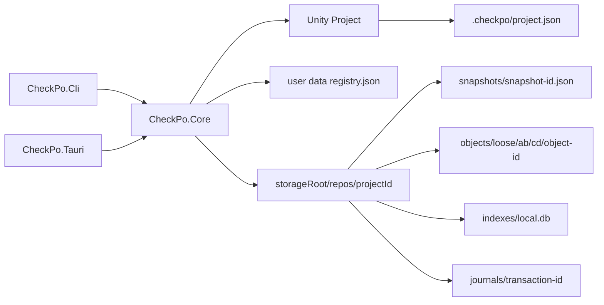

# アーキテクチャ

この文書は CheckPo Local の現在の実装を説明します。

## 全体像

CheckPo Local は、Unity プロジェクトの `Assets/**`、`Packages/**`、`ProjectSettings/**` に含まれるファイルだけを checkpoint / diff / restore / discard の対象にします。Git の branch / merge / conflict などの概念はユーザーに見せません。

プロジェクト内には path-free marker だけを置き、checkpoint の正本は外部 storage root の `snapshots/` と `objects/` に保存します。SQLite は再構築可能な index であり、正本ではありません。



## 安全境界

破壊的操作の安全境界は project root ではありません。対象にできるのは `TrackedUnityFilePath` として validation された file path だけです。

許可範囲:

```text
Assets/**
Packages/**
ProjectSettings/**
```

拒否するもの:

- `Assets`、`Packages`、`ProjectSettings` という root 自体
- `README.md`、`.git/config`、`Library/**`、`UserSettings/**`
- absolute path
- `..`、`.`、empty segment
- backslash、colon、Windows drive path
- Windows 予約名、末尾 dot/space の path segment

`TrackedUnityFilePath`、`SnapshotId`、`ObjectId` は JSON deserialize 時にも validation を通します。snapshot 読み込み時は schema、files sort、entry size、canonical digest を検証し、壊れた snapshot は restore / discard / diff / index の通常操作へ渡しません。

## Core モジュール

| モジュール | 責務 |
| --- | --- |
| `path.rs` | `TrackedUnityFilePath`、`SnapshotId`、`ObjectId`、project/storage root 型、path validation。 |
| `project.rs` | project marker、storage registry、repo 初期化、project view 生成。 |
| `scanner.rs` | tracked roots のみを walk し、symlink を辿らず file entry を列挙。 |
| `storage.rs` | repo layout、repo config、atomic write、whole-file object store、snapshot store、repository lock。 |
| `checkpoint.rs` | checkpoint 作成、snapshot 保存、refs/latest 更新、best effort index 更新。 |
| `diff.rs` | snapshot と working tree の差分計算。 |
| `restore.rs` | working tree 全体を checkpoint へ戻す preview/apply 境界。 |
| `discard.rs` | 指定 tracked file path だけを checkpoint へ戻す preview/apply 境界。 |
| `transaction.rs` | restore/discard 共通の operation plan、journal、staging、backup move、mtime 復元、recovery、cleanup。 |
| `verify.rs` | repo / snapshot / object / refs/latest の quick/full verification。 |
| `db.rs` | SQLite index schema、snapshot/object index、index rebuild。 |
| `maintenance.rs` | storage summary、GC、project 内 CheckPo 一時ファイル cleanup。 |

## Project Marker と Registry

プロジェクト側:

```text
<Unity Project>/.checkpo/project.json
```

marker には次だけを保存します。

```json
{
  "schemaVersion": 1,
  "projectId": "uuid",
  "createdAtUtc": "2026-06-09T00:00:00.000000000Z"
}
```

storage root や project root の絶対パスは marker に入れません。storage root は user data dir 側の `registry.json` に project id ごとに保存します。

`projectId` は checkpoint lineage の ID であり、Unity project の物理 path ではありません。project root は移動・リネームされる前提で、registry の `lastProjectRootPath` は「最後に確認された場所」として扱います。

project を開いた時の location 判定:

1. 現在 path と registry の path が同じなら通常状態。
2. registry の path が存在しない、または存在しても同じ `projectId` の marker が無い場合は移動・リネーム扱い。registry を現在 path に更新できます。
3. registry の path に同じ `projectId` の marker が残っている場合はコピー疑い。Core は checkpoint 作成、削除、restore / discard apply、GC apply、index rebuild、storage root 変更などの変更操作を拒否します。

コピー疑いの場合、ユーザーは明示的に現在 path を同じ project として使うか、新しい `projectId` で別 project として開始します。履歴を複製して別 project にする機能は MVP 対象外です。

## Repository Layout

storage root 側:

```text
<storage-root>/
  registry.json
  repos/
    <project-id>/
      repo.json
      refs/
        latest
      snapshots/
        <snapshot-id>.json
      objects/
        loose/
          ab/
            cd/
              <object-id>
      indexes/
        local.db
      journals/
        <transaction-id>/
          journal.json
          staged/
          backup/
      tmp/
      locks/
```

`repo.json` は schema version、repo format version、project id、hash algorithm、snapshot format、object format だけを持ちます。旧 schema との migration や fallback はありません。

## Snapshot と Object

snapshot id は canonical snapshot JSON bytes の BLAKE3 です。snapshot JSON 自体に自己参照する digest field は持ちません。

object id は file bytes の BLAKE3 です。MVP は whole-file CAS のみで、object path は `objects/loose/ab/cd/<object-id>` です。

checkpoint 作成順:

1. repository lock を取得する。
2. pending transaction があれば拒否する。
3. tracked roots を scan する。
4. object を保存し、hash / size を検証する。
5. files を path 昇順に sort して snapshot を作る。
6. snapshot を atomic write する。
7. `refs/latest` を atomic update する。
8. SQLite index を best effort で更新する。

SQLite index 更新に失敗しても、snapshot と object と latest ref の保存が終わっていれば checkpoint は成立します。失敗は warning として返します。

## Diff

diff は snapshot と working tree の比較です。

- snapshot に無く working tree にある tracked file: added
- snapshot にあり working tree に無い tracked file: deleted
- 両方にあり object hash が違う file: modified
- 両方にあり object hash が同じ file: unchanged

working tree 側も tracked roots だけを scan し、すべての path を `TrackedUnityFilePath` に通します。

## Restore / Discard / Transaction

restore は working tree 全体を checkpoint に戻します。discard は指定した tracked file path だけを checkpoint に戻します。どちらも同じ `OperationPlan` と transaction engine を使います。

apply 手順:

1. repository lock を取得する。
2. pending transaction があれば拒否する。
3. preview と現在状態が一致するか再確認する。
4. Restore / Replace 用 object を `staged/` に展開し、hash / size を検証する。
5. journal state を `Staged` にする。
6. critical section 直前に precondition を再確認する。
7. journal state を `Applying` にする。
8. Delete / Replace 対象の現在 file を削除せず `backup/` に move する。
9. staged file を destination へ rename する。
10. Restore / Replace の mtime を snapshot の `modifiedAtUtc` に復元する。
11. journal state を `Committed` にする。

committed journal の cleanup は maintenance command で行います。未完了 transaction がある場合、新しい mutating operation は拒否します。

## Verify

verify は warning と error を分けて返します。

quick verify:

- `repo.json` が schema v1 と一致すること
- snapshot filename が valid `SnapshotId` であること
- snapshot JSON が validation 済み model として読めること
- canonical snapshot bytes の digest が filename と一致すること
- snapshot files が path 昇順であること
- object file が存在し、size が一致すること
- `refs/latest` が存在する場合は valid snapshot を指すこと
- invalid extra json filename は warning にすること

full verify は quick に加えて object file の BLAKE3 hash を再計算します。

## CLI / Tauri

CLI は `clap` を使い、unknown option を error にします。restore/discard apply は preview で作った expected plan を受け取り、apply 時に plan が stale なら拒否します。

Tauri backend は Core API を直接呼びます。operation scheduler は同時 operation を 1 つに制限し、`cancel_current_operation` だけは常に呼べる command として扱います。UI の disabled 状態には安全性を依存しません。

コピー疑いなどの location safety は UI だけでなく Core 側でも検証します。

将来 cloud 対応する場合も、`projectId` は cloud repository id とは分けます。cloud 上の同期・共有単位には別の `cloudRepositoryId` を導入し、端末やインストール識別には必要になった時点で `deviceId` / `installationId` を追加します。

## 非互換性

このプロジェクトは未リリース段階のため、旧 marker / repository / snapshot schema の migration は実装しません。旧 schema を読む fallback、互換維持だけの wrapper API、storage root の自動移動は現在の MVP の対象外です。desktop updater と release workflow は実装済みですが、cloud / pack / encryption は対象外です。
